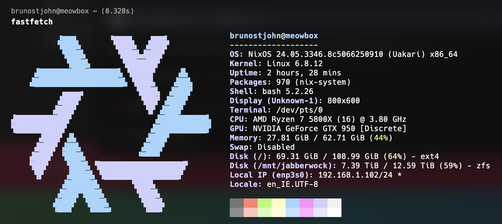
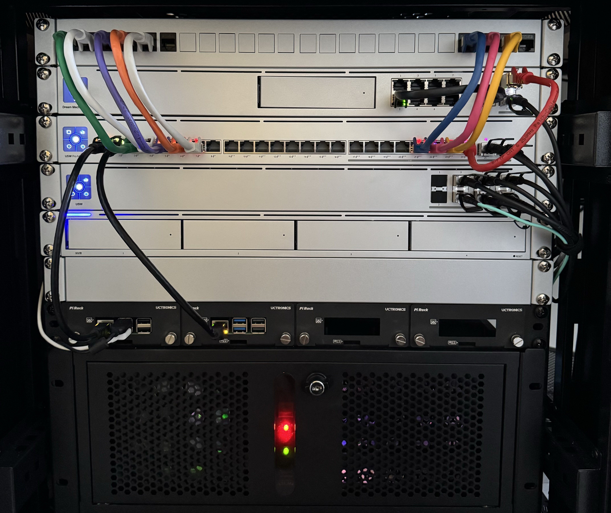

## DeadFrost

 

  

<h3 align="center">Homelab</h3>

  
    A declaratively configured, somewhat reproducible k3s cluster configured using IaC tools and some other stuff I use to keep myself sane.
  

 

 

  

    <b>Hardware</b>
  

  
   

  <ul>
    <li>
      <a href="https://ui.com/eu/en/cloud-gateways/large-scale">UniFi Dream Machine Pro</a> - Gateway & Firewall
    </li>
    <li>
      <a href="https://ui.com/eu/en/switching/enterprise">UniFi Aggregation</a> - Aggregating Switch
    </li>
    <li>
      <a href="https://ui.com/eu/en/switching/professional-max">UniFi Switch Pro Max 24 PoE</a> - Main Switch
    </li>
    <li>
      <a href="https://www.raspberrypi.com/products/raspberry-pi-3-model-b/">Raspberry Pi 3B</a> & <a href="https://www.raspberrypi.com/products/raspberry-pi-5/">Raspberry Pi 5</a> - Cluster nodes
    </li>
    <li>
        
Big guy server

        
    </li>
  </ul>

   

  

  
It's all rack mountable? <b>Always has been.</b>

  

    <b>Software</b>
  

  <blockquote>This section is still mostly incomplete. TBD.</blockquote>

   
 
  
All nodes

  <ul>
    <li>
      <a href="https://www.docker.com/">Docker</a> - because installing software without containers in 2024 is for the exceedingly resillient, or insane.
    </li>
    <li>
      <a href="https://k3s.io/">K3S</a> - because I don't need full k8s for this and some stuff k8s does is still super useful.
    </li>
    <li>
      <a href="https://metallb.universe.tf/">MetalLB</a> - this is a classic and easy to use L2 load balancer for k8s clusters. Super neat piece of software. Give it a pool of IPs and it'll sort out the rest.
    </li>
  </ul>

   

  
Big Guy Server

  <ul>
    <li>
      <a href="https://nixos.org/">NixOS</a> - because it's declarative, and I've lost enough Linux configuration files in this lifetime. Just let me have a <i>One True File™</i> and I'll be happy.
    </li>
    <li>
      <a href="https://caddyserver.com">Caddy</a> - because it's a great reverse proxy for people without the time to type out elaborate configs.
    </li>
  </ul>

   

  
Raspberry Pis

  <ul>
    <li>
      <a href="https://dietpi.com">DietPi</a> - because it's light as heck.
    </li>
    <li>
      <a href="https://www.ansible.com">Ansible</a> - because I don't want to re-type commands a million times every time I need them to run everywhere.
    </li>
  </ul>

   

  
Tooling

  <ul>
    <li>
      <a href="https://taskfile.dev/">Task</a> - because I hate re-typing things a million times.
    </li>
    <li>
      <a href="https://nix.dev/manual/nix/2.18/command-ref/nix-shell">Nix Shell</a> - because re-setting up terminal environments on different machines takes too much time and is too annoying.
    </li>
    <li>
      <a href="https://www.terraform.io/">Terraform</a> - because UIs take a long time if you know <i>exactly</i> what you want to do. (but Terraform still manages to take longer, I just don't need to click on anything 😂).
    </li>
  </ul>

  

    <b>Should I run this on my machine(s)?</b>
  

  <h3> HELL NO </h3>

  

    I am right now in the middle of migrating over the 6 different Git repositories I have on my cluster to GitHub. Even when I'm done migrating stuff here, running this on your set-up might be a bad idea. Please do that <i>only if you know what you're doing</i>, and don't expect to be supported by me in the process. I'm only putting this out here for people to learn from it and to be able to easier talk about my hobby with other people that share it.
  

